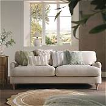
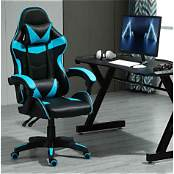
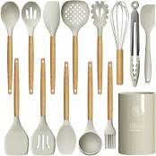

# Amazon Clone Project

I made this homepage from scratch using HTML, CSS, and JavaScript.

---

## What I Did

I started by writing the HTML to build the whole page structure. Then I styled it with CSS, the navigation bar, colours, boxes, footer, everything. After that I added JavaScript to make it work: search bar, hover effects, and smooth scroll back to top.

I found all the images myself, the logo, the main banner, and the four product pictures and put them all in the same folder so they show up correctly.
## 📸 Project Preview

### Main Page

### Logo

### Product Sections
| Box 1 | Box 2 | Box 3 | Box 4 |
|---|---|---|---|
|  |  |  |  |

## Files Included

- index.html: the full page
- style.css: all the design and layout
- script.js: the search and other actions
- Amazon_logo.jpg
- main_page.gif
- box1.jpg, box2.jpg, box3.jpg, box4.jpg

## How It Works

- Type something in the search box and click the icon, it shows what you searched for
- Hover over the boxes, they get a little bigger
- Click "Back to Top" at the bottom, it scrolls up smoothly
- Everything shows properly in any browser

## What I Learned

- How to write HTML and link CSS and JavaScript
- How to make sure all images load by using the right file names
- How to fix things when they don't work
- Step by step, I built the whole thing myself

---

Made by Shumaila
